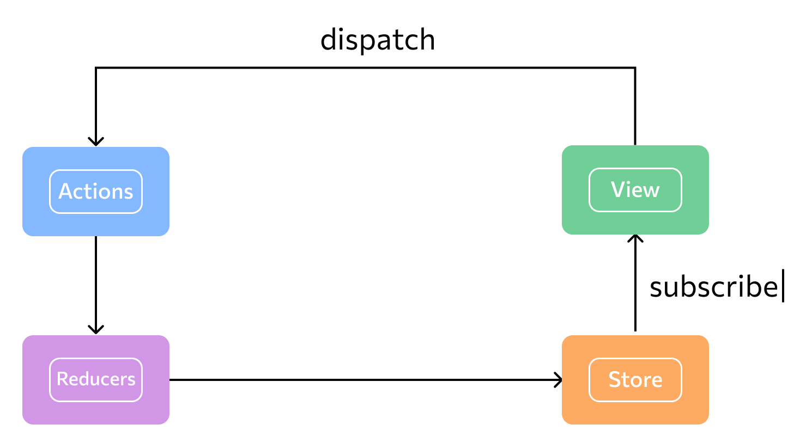

# iOS unidirectional flow with Combine
## Example implementation of a unidirectional data flow pattern for with SwiftUI and a little bit of Combine and promises.

Actions can be dispatched from views like this `store.dispatch(ReduxAction.remoteExample(parameter: "hi \(name)!"))` then the `Middleware` will catch them, perform the remote networking call, receive result and pass that back to the `Reducer` through another `Action`.

Implementation uses no external dependencies. It relies on `Combine` and `URLSession.shared.dataTaskPublisher(for: request)` to publish networking call results.

